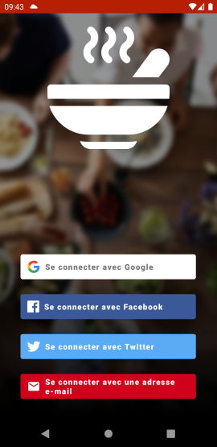
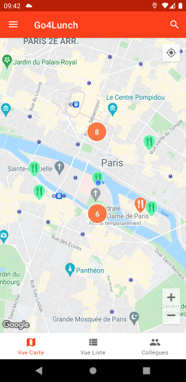
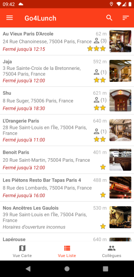
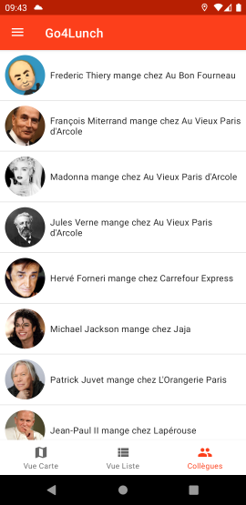
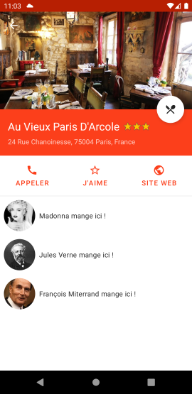
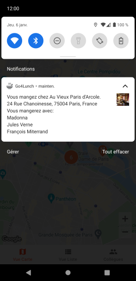

# Go4Lunch

Application du 7ème projet du parcours OpenClassrooms « Développeur d’application - Android » 

## Description

Application pour permettre à un groupe de personnes de se mettre d’accord sur un restaurant où déjeuner ensemble.

Les restaurants à proximité s’affichent sur une carte ou sous forme de liste. Chaque personne peut indiquer l’endroit où elle compte déjeuner et visualiser le lieu choisi par les autres personnes. Une notification apparaît chaque jour à midi pour rappeler à chacun son choix.

## Compétences mises en œuvre

- Développée en **Java**

- Architecture **MVVM**
- **RxJava** est utilisé pour gérer l’asynchronicité
- **Retrofit** pour les appels réseau
- **Google Maps** pour afficher la carte
- **Google Places** pour la liste des restaurants
- **Firebase** pour l’authentification et le stockage des données non structurées
- Connexion possible via un compte **Google**, **Facebook**, **Twitter** ou via une adresse e-mail

## Aperçu de l’application
### Écran de connexion
 

### Vues principales
   

### Vue détails
 

### Notification
 